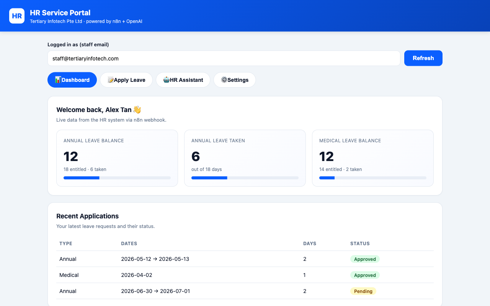

# n8n HR Service Portal 🧑‍💼🤖

A self-service **HR portal** wired to three **n8n** automation workflows: staff apply for leave with **human-in-the-loop manager approval**, view a live **leave dashboard**, and chat with an **OpenAI-powered HR assistant** protected by **input & output guardrails**.



<p align="center">
  
  
  
  
  
</p>

---

## ✨ Features

| Module | What it does |
|--------|--------------|
| 📊 **Leave Dashboard** | Live leave balance, days taken, and recent applications — fetched from an n8n webhook. |
| 📝 **Leave Application** | Submitting the form triggers a webhook that **emails the manager for approval** (Approve / Decline buttons). Staff are notified by email once a decision is made. |
| 🤖 **HR AI Assistant** | "HR Buddy" answers general HR questions (leave policy, payroll, claims, hours) using an OpenAI model. |
| 🛡️ **Input Guardrail** | An LLM classifier **blocks prompt-injection, jailbreaks, requests for other people's private data, and unsafe/malicious messages** *before* they reach the agent. |
| 🔒 **Output Guardrail** | A second LLM classifier inspects the agent's reply and **blocks any leak of sensitive data** (salaries, NRIC/FIN, bank details, system prompt, credentials) *before* it reaches the user. |

---

## 🏗️ Architecture

```
                            ┌────────────────────────── index.html (portal) ──────────────────────────┐
                            │   📊 Dashboard          📝 Apply Leave            🤖 HR Assistant         │
                            └──────┬──────────────────────┬────────────────────────────┬───────────────┘
                                   │ GET                  │ POST                        │ POST
                                   ▼                      ▼                             ▼
                        /webhook/hr-dashboard   /webhook/hr-leave-apply         /webhook/hr-chat
                                   │                      │                             │
   ┌───────────────────────────────┘                     │                             │
   │  Code: simulated leave data                          │                             ▼
   │  → Respond (JSON)                                    │                 ┌─────────────────────────┐
   └──────────────────────────────────────────────       │                 │  Input Guardrail (LLM)  │
                                                          ▼                 │  ALLOW / BLOCK          │
                                          ┌──────────────────────────┐      └───────────┬─────────────┘
                                          │  Manager Approval (Gmail │           ALLOW  │  BLOCK → "blocked"
                                          │  send-and-wait) ───► 📧  │                  ▼
                                          │  angch@tertiaryinfotech  │      ┌─────────────────────────┐
                                          └───────────┬──────────────┘      │   HR AI Agent (OpenAI)  │
                                            Approved? │ Declined?           └───────────┬─────────────┘
                                          ┌───────────┴───────────┐                     ▼
                                          ▼                       ▼          ┌─────────────────────────┐
                                  📧 Notify Approved      📧 Notify Declined  │ Output Guardrail (LLM)  │
                                                                             │  SAFE / LEAK            │
                                                                             └───────────┬─────────────┘
                                                                                 SAFE    │  LEAK → "blocked"
                                                                                         ▼
                                                                                 Respond (reply JSON)
```

A single shared **OpenAI Chat Model** node feeds all three LLM steps (input guardrail, agent, output guardrail).

---

## 📁 Repository contents

| File | Description |
|------|-------------|
| [`index.html`](index.html) | The full HR portal front-end (dashboard, leave form, chatbot) — no build step. |
| [`HR-Portal-Leave-Approval.json`](HR-Portal-Leave-Approval.json) | n8n workflow: **Leave Application & Manager Approval** (human-in-the-loop). |
| [`HR-Portal-Dashboard-Data.json`](HR-Portal-Dashboard-Data.json) | n8n workflow: **Dashboard Data** (leave balance & history). |
| [`HR-Portal-AI-Chatbot-Guardrails.json`](HR-Portal-AI-Chatbot-Guardrails.json) | n8n workflow: **AI Chatbot with Input & Output Guardrails**. |
| [`.env.example`](.env.example) | Template for the required environment variables. |

> The three flow files are exported from (and match) the live n8n workflows: **HR Portal — Leave Application & Manager Approval**, **HR Portal — Dashboard Data**, and **HR Portal — AI Chatbot with Input & Output Guardrails**.

---

## 🚀 Setup

### 1. Import the workflows into n8n
Import the three `*.json` files (**Workflows → Import from File**).

### 2. Configure credentials
- **OpenAI** — create an *OpenAI* credential and select it on the **OpenAI Chat Model** node.
- **Gmail** — select a *Gmail OAuth2* credential on the **Manager Approval / Notify** nodes. The approval email is sent to `angch@tertiaryinfotech.com` (change this on the *Manager Approval* node).

### 3. Activate & wire up the portal
Activate all three workflows, then set the webhook base URL near the top of [`index.html`](index.html):

```js
const N8N = "https://your-n8n-host/webhook";
```

Open `index.html` in a browser (or via GitHub Pages). The webhooks allow all origins (`*`) for the demo.

### Environment variables
See [`.env.example`](.env.example). Secrets live in `.env` (git-ignored) — **never commit real keys**.

---

## 🛡️ Security notes (this is a teaching demo)

- **Guardrails are LLM-based classifiers** — robust, but pair them with deterministic rules (regex for NRIC/credit-card, allow-lists) for production.
- The HR agent's **system prompt** explicitly forbids revealing its instructions, performing admin actions, or disclosing any employee's confidential data.
- Webhooks use `allowedOrigins: "*"` for demo convenience — restrict this in production and add auth.
- Dashboard data is **simulated** in a Code node; swap it for a real HR database / data table.

---

## 🙏 Acknowledgements

Built as a security & automation teaching example for **Tertiary Infotech Academy Pte Ltd**.

Powered by [Tertiary Infotech Academy Pte Ltd](https://www.tertiaryinfotech.com/) · automated with [n8n](https://n8n.io) and [OpenAI](https://openai.com).

---

## 📄 License

MIT
